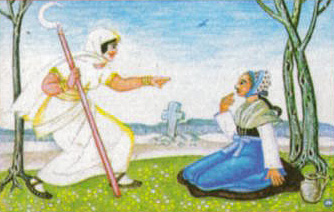

# Die virtuelle Mittagsfrau

Für [Coding da Vinci Ost 2018](https://codingdavinci.de/events/ost/).

> Die [Mittagsfrau](https://de.wikipedia.org/wiki/Mittagsfrau) ist ein Naturgeist in weiblicher Gestalt in der slawischen Sagenwelt.

> Die pŕezpołnica hatte den serp (Sichel) in der Hand, und sagte, wenn jemand
> mittags auf dem Felde war: "Serp a šyju, Sichel und Hals". Und wer nicht eine
> Stunde lang erzählen konnte, dem hat sie den Kopf abgehauen"

## Daten

* https://speicherwolke.uni-leipzig.de/index.php/s/C99LbgXSSPdgFxV
* [Lokale Kopie](https://github.com/sophiamanns/virtuelle_mittagsfrau/tree/master/data)

109 Bilder.

# TODO

* [ ] Excel Tags
* [ ] SLUB Fotothek Landscape, Geolocation, Cities (20-30)
* [ ] Webapp (Index, Details)
* [ ] Database
* [ ] SlotMachine-Details, responsive design
* [ ] Hosting
* [ ] First translations (Anja, Wito)
* [ ] More stories
* [ ] Project texts and usage scenarios, for site and presentation

